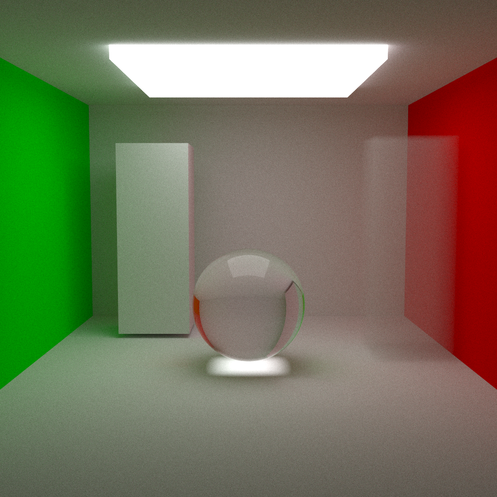

# Raytracer

### Overview
This project is an attempt at making a simple raytracer built from the ground up in rust.
I am currently following a walkthrough that covers all the fundamentals of how raytracing
works at its core and implementing it in rust.

### Links
- The walkthrough: [Ray Tracing in One Weekend — The Book Series](https://raytracing.github.io/)

### How to use

To render the scene run: 
```commandline
cargo run
```



Samples Per Pixel: 600

Light Bouce Depth: 100